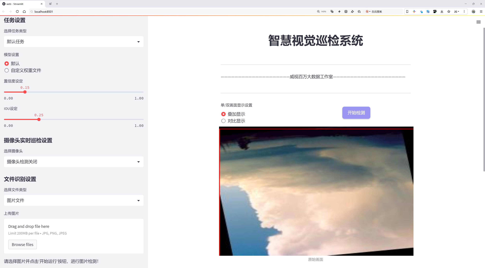
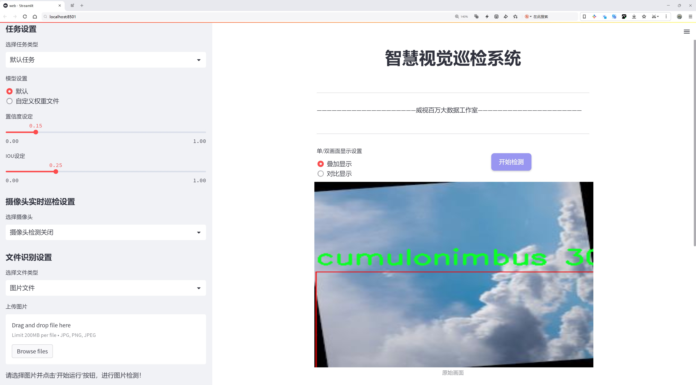
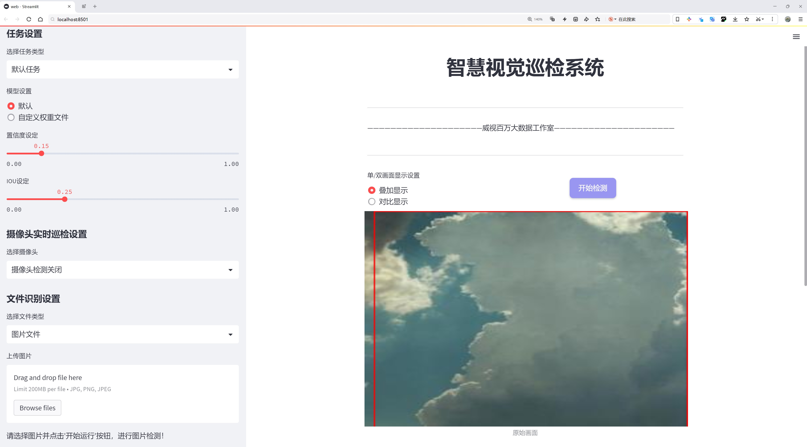
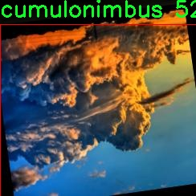
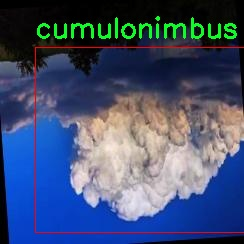
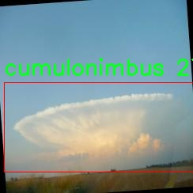
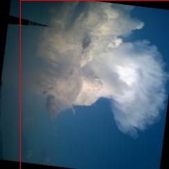
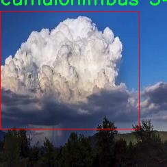

# 云层类型识别系统源码分享
 # [一条龙教学YOLOV8标注好的数据集一键训练_70+全套改进创新点发刊_Web前端展示]

### 1.研究背景与意义

项目参考[AAAI Association for the Advancement of Artificial Intelligence](https://gitee.com/qunmasj/projects)

项目来源[AACV Association for the Advancement of Computer Vision](https://kdocs.cn/l/cszuIiCKVNis)

研究背景与意义

随着全球气候变化的加剧，云层的变化对天气预报、气候研究及航空安全等领域的重要性愈发凸显。云层不仅是气象学研究的关键对象，也是影响地球辐射平衡和水循环的重要因素。不同类型的云层具有不同的物理特性和气象效应，因此，准确识别和分类云层类型对于理解气候变化、优化天气预报模型以及提升航空安全具有重要意义。近年来，深度学习技术的迅猛发展为图像识别领域带来了新的机遇，尤其是在物体检测和分类任务中表现出色。YOLO（You Only Look Once）系列模型因其高效的实时检测能力而广泛应用于各类视觉识别任务。

本研究旨在基于改进的YOLOv8模型，构建一个高效的云层类型识别系统。该系统将利用一个包含1800张图像的云层数据集，涵盖六种主要云层类型：积雨云（cumulonimbus）、积云（cumulus）、层积云（stratocumulus）、层云（stratus）和雨层云（nimbostratus）。这些云层类型在气象学中具有显著的区分特征，能够为气象预报提供丰富的信息。然而，传统的云层识别方法往往依赖于人工经验，存在识别效率低、准确性差等问题。因此，利用深度学习技术进行自动化云层识别，不仅可以提高识别的准确性，还能大幅提升处理速度。

在此背景下，改进YOLOv8模型的应用尤为重要。YOLOv8在保持高精度的同时，进一步优化了模型的速度和效率，使其能够在复杂的气象条件下实现实时云层检测。这一特性使得YOLOv8特别适合用于动态变化的天气环境中，能够及时捕捉到云层的变化情况。此外，数据集中的多样性和丰富性为模型的训练提供了良好的基础，确保了模型在不同云层类型识别上的鲁棒性。

本研究的意义不仅在于提升云层类型识别的技术水平，更在于为气象学研究提供新的工具和方法。通过建立一个高效的云层识别系统，可以为气象预报提供更为精准的云层信息，从而提高天气预报的准确性和时效性。此外，该系统的成功应用还将为航空安全提供重要保障，帮助航空公司和飞行员在飞行过程中更好地应对复杂的气象条件，降低飞行风险。

综上所述，基于改进YOLOv8的云层类型识别系统的研究具有重要的理论价值和实际应用意义。它不仅推动了云层识别技术的发展，也为气象学、环境监测及航空安全等领域提供了新的研究思路和实践方案。通过深入研究和应用该系统，我们期望能够为应对气候变化带来的挑战贡献一份力量，同时推动相关领域的科学进步。

### 2.图片演示







##### 注意：由于此博客编辑较早，上面“2.图片演示”和“3.视频演示”展示的系统图片或者视频可能为老版本，新版本在老版本的基础上升级如下：（实际效果以升级的新版本为准）

  （1）适配了YOLOV8的“目标检测”模型和“实例分割”模型，通过加载相应的权重（.pt）文件即可自适应加载模型。

  （2）支持“图片识别”、“视频识别”、“摄像头实时识别”三种识别模式。

  （3）支持“图片识别”、“视频识别”、“摄像头实时识别”三种识别结果保存导出，解决手动导出（容易卡顿出现爆内存）存在的问题，识别完自动保存结果并导出到tempDir中。

  （4）支持Web前端系统中的标题、背景图等自定义修改，后面提供修改教程。

  另外本项目提供训练的数据集和训练教程,暂不提供权重文件（best.pt）,需要您按照教程进行训练后实现图片演示和Web前端界面演示的效果。

### 3.视频演示

[3.1 视频演示](https://www.bilibili.com/video/BV14C23YKEaq/)

### 4.数据集信息展示

##### 4.1 本项目数据集详细数据（类别数＆类别名）

nc: 5
names: ['cumulonimbus', 'cumulus', 'nimbostratus', 'stratocumulus', 'stratus']


##### 4.2 本项目数据集信息介绍

数据集信息展示

在本研究中，我们使用的数据集名为“dataset_awan”，旨在训练和改进YOLOv8模型，以实现高效的云层类型识别。该数据集包含五种主要的云层类型，分别为：积雨云（cumulonimbus）、积云（cumulus）、层云（nimbostratus）、层积云（stratocumulus）和卷云（stratus）。这些云层类型在气象学中具有重要的意义，它们不仅影响天气预报的准确性，还对气候变化的研究提供了重要的参考。

“dataset_awan”数据集的设计考虑了多样性和代表性，确保能够涵盖不同环境和气候条件下的云层特征。每种云层类型的样本均经过精心挑选，涵盖了从晴朗的天空到阴雨天气的多种场景。这样的多样性使得模型在训练过程中能够学习到不同云层的特征，从而提高其识别的准确性和鲁棒性。

在数据集的构建过程中，我们采用了高分辨率的图像，以确保细节的清晰可辨。每一类云层的图像均经过标注，确保训练数据的质量和准确性。标注过程中，我们不仅考虑了云层的形态特征，还注重了云层在不同光照条件下的表现，这为模型的训练提供了更为丰富的上下文信息。

此外，数据集还包含了云层在不同季节和时间段的变化，这使得模型能够学习到云层类型的时效性和环境适应性。例如，积雨云通常在夏季频繁出现，而层云则可能在冬季更为常见。通过这样的数据多样性，模型能够更好地适应不同的气象条件，提高其在实际应用中的表现。

在训练过程中，我们将“dataset_awan”数据集分为训练集、验证集和测试集，以确保模型的泛化能力。训练集用于模型的学习和参数调整，验证集用于监控模型的性能，而测试集则用于最终的评估。这种划分方式能够有效避免过拟合现象，确保模型在未见数据上的表现同样优秀。

随着深度学习技术的不断发展，YOLOv8作为一种先进的目标检测模型，具备了实时处理和高效识别的能力。通过对“dataset_awan”数据集的训练，我们期望能够提升YOLOv8在云层类型识别方面的性能，使其能够在气象监测、航空安全等领域发挥更大的作用。

总之，“dataset_awan”不仅是一个用于训练云层类型识别系统的重要资源，更是推动气象学研究和应用的重要工具。通过对该数据集的深入分析和应用，我们相信能够为云层识别技术的发展做出积极贡献，并为未来的气象研究提供新的视角和思路。











### 5.全套项目环境部署视频教程（零基础手把手教学）

[5.1 环境部署教程链接（零基础手把手教学）](https://www.ixigua.com/7404473917358506534?logTag=c807d0cbc21c0ef59de5)


[5.2 安装Python虚拟环境创建和依赖库安装视频教程链接（零基础手把手教学）](https://www.ixigua.com/7404474678003106304?logTag=1f1041108cd1f708b01a)

### 6.手把手YOLOV8训练视频教程（零基础小白有手就能学会）

[6.1 手把手YOLOV8训练视频教程（零基础小白有手就能学会）](https://www.ixigua.com/7404477157818401292?logTag=d31a2dfd1983c9668658)


按照上面的训练视频教程链接加载项目提供的数据集，运行train.py即可开始训练



     Epoch   gpu_mem       box       obj       cls    labels  img_size
     1/200     20.8G   0.01576   0.01955  0.007536        22      1280: 100%|██████████| 849/849 [14:42<00:00,  1.04s/it]
               Class     Images     Labels          P          R     mAP@.5 mAP@.5:.95: 100%|██████████| 213/213 [01:14<00:00,  2.87it/s]
                 all       3395      17314      0.994      0.957      0.0957      0.0843

     Epoch   gpu_mem       box       obj       cls    labels  img_size
     2/200     20.8G   0.01578   0.01923  0.007006        22      1280: 100%|██████████| 849/849 [14:44<00:00,  1.04s/it]
               Class     Images     Labels          P          R     mAP@.5 mAP@.5:.95: 100%|██████████| 213/213 [01:12<00:00,  2.95it/s]
                 all       3395      17314      0.996      0.956      0.0957      0.0845

     Epoch   gpu_mem       box       obj       cls    labels  img_size
     3/200     20.8G   0.01561    0.0191  0.006895        27      1280: 100%|██████████| 849/849 [10:56<00:00,  1.29it/s]
               Class     Images     Labels          P          R     mAP@.5 mAP@.5:.95: 100%|███████   | 187/213 [00:52<00:00,  4.04it/s]
                 all       3395      17314      0.996      0.957      0.0957      0.0845


### 7.70+种全套YOLOV8创新点代码加载调参视频教程（一键加载写好的改进模型的配置文件）

[7.1 70+种全套YOLOV8创新点代码加载调参视频教程（一键加载写好的改进模型的配置文件）](https://www.ixigua.com/7404478314661806627?logTag=29066f8288e3f4eea3a4)

### 8.70+种全套YOLOV8创新点原理讲解（非科班也可以轻松写刊发刊，V10版本正在科研待更新）

#### 由于篇幅限制，每个创新点的具体原理讲解就不一一展开，具体见下列网址中的创新点对应子项目的技术原理博客网址【Blog】：


[8.1 70+种全套YOLOV8创新点原理讲解链接](https://gitee.com/qunmasj/good)

#### 部分改进原理讲解(完整的改进原理见上图和技术博客链接)【如果此小节的图加载失败可以通过CSDN或者Github搜索该博客的标题访问原始博客，原始博客图片显示正常】
### YOLOv8简介
目前YOLO系列的SOTA模型是ultralytics公司于2023年发布的YOLOv8.按照模型宽度和深度不同分为YOLOv8n、YOLOv8s、YOLOv8m、YOLOv81、YOLOv8x五个版本。本文改进的是 YOLOv8n模型。
YOLOv8的 Backbone采用CSPDarknet结构，它是 Darknet 的一种改进，引入CSP改善网络结构。CSPDarknet把特征图分为两部分，一部分进行卷积操作，另一部分进行跳跃连接，在保持网络深度的同时减少参数量和计算量，提高网络效率。Neck 部分采用特征金字塔PANet[17]，通过自顶向下路径结合和自底向上特征传播进行多尺度融合。损失函数采用了CIloU[18]。YOLOv8的网络结构如图所示。


### ParC融合位置感知循环卷积简介
ParC：Position aware circular convolution


#### Position aware circular convolution
针对于全局信息的提取作者提出了Position aware circular convolution（也称作Global Circular Convolution）。图中左右实际是对于该操作水平竖直两方向的对称，理解时只看左边即可。对于维度为C*H*W的输入，作者先将维度为C*B*1的Position Embedding通过双线性插值函数F调整到适合input的维度C*H*1（以适应不同特征大小输入），并且将PE水平复制扩展到C*H*W维度与输入特征相加。这里作者将PE直接设置成为了可学习的参数。

接下来参考该博客将加入PE的特征图竖直方向堆叠，并且同样以插值的方式得到了适应输入维度的C*H*1大小的卷积核，进行卷积操作。对于这一步卷积，作者将之称为循环卷积，并给出了一个卷积示意图。


但个人感觉实际上这个示意图只是为了说明为什么叫循环卷积，对于具体的计算细节还是根据公式理解更好。


进一步，作者给出了这一步的伪代码来便于读者对这一卷积的理解：y=F.conv2D（torch.cat（xp，xp，dim=2），kV），实际上就是将xp堆叠之后使用了一个“条形（或柱形）”卷积核进行简单的卷积操作。（但这样会导致多一次重复卷积，因此在堆叠示意图中只取了前2*H-1行）

可以看到在示意图中特征维度变化如下：C*(2H-1)*W ---C*H*1--->C*H*W，作者特意带上了通道数，并且并没有出现通道数的改变，那么这里所进行的卷积应该是depth wise卷积，通过对文章后续以及论文源码的阅读可以得知这一步进行的就是DW卷积。（we introduce group convolution and point wise convolution into these modules, which decreases number of parameters without hurting performance.）


由groups = channel可知使用的是DW卷积
通过上面就完成了一次竖直方向的全局信息交流，同样只要在水平方向进行同样的操作即可做到水平方向的全局信息交流。

#### ParC block

通过ParC成功解决了全局信息提取的问题，接下来就是针对2）3）两点进行改进。首先是Meta-Former模块，Meta-Former由Token Mixer和Channel Mixer构成，ParC首先满足了Token Mixer的全局信息提取的要求，并且相较于Attention在计算成本上更低。


这里①中的PWC即point wise conv，进一步验证了我们前面对于深度可分离卷积的想法，而GCC-H/V即是前面所说的ParC-H/V。

①构建了Meta-Former中的Token mixer模块，那么最后剩下的问题就是3），替换掉Attention模块之后模型不再data driven。为了解决这一点作者给出了一个channel wise attention，先将特征图（x,C*H*W）进行global average（a,C*1*1）并输入一个MLP生成一个channel wise的权重（w,C*1*1），再将权重与特征图在通道方向相乘得到输出（output = wx,C*H*W）。

#### ParC net
对于ParC net 的搭建，作者直接基于MobileViT，采用了分叉结构（c）完成了网络的搭建。


具体而言作者保留了MobileViT中浅层具有局部感受野的MobileNetV2结构，而将网络深层的ViT block替换成了ParC block，使网络变成了一个pure ConvNet。


### 9.系统功能展示（检测对象为举例，实际内容以本项目数据集为准）

图9.1.系统支持检测结果表格显示

  图9.2.系统支持置信度和IOU阈值手动调节

  图9.3.系统支持自定义加载权重文件best.pt(需要你通过步骤5中训练获得)

  图9.4.系统支持摄像头实时识别

  图9.5.系统支持图片识别

  图9.6.系统支持视频识别

  图9.7.系统支持识别结果文件自动保存

  图9.8.系统支持Excel导出检测结果数据


### 10.原始YOLOV8算法原理

原始YOLOv8算法原理

YOLO（You Only Look Once）系列算法自诞生以来便以其卓越的目标检测性能和实时处理能力受到广泛关注。随着技术的不断进步，YOLO算法经历了多个版本的迭代，而YOLOv8作为最新的版本，进一步优化了检测精度和速度，成为当前目标检测领域的前沿技术。YOLOv8的架构设计在继承了YOLOv5和YOLOv7的基础上，融入了新的特性和改进，展现出强大的性能。

YOLOv8的网络结构主要由四个部分组成：输入层、Backbone（主干网络）、Neck（特征融合网络）和Head（检测模块）。输入层负责对输入图像进行预处理，包括调整图像比例、进行Mosaic增强和瞄点计算等操作。这些预处理步骤为后续的特征提取和目标检测奠定了基础。Backbone部分则是YOLOv8的核心，采用了CSPDarknet的思想，利用C2f模块替代了YOLOv5中的C3模块。这一改进不仅保持了轻量化特性，还显著提升了检测精度。C2f模块通过引入ELAN（Efficient Layer Aggregation Network）思想，增强了梯度流动，使得网络在深层次特征提取时能够更好地保留信息，避免了梯度消失的问题。

在特征提取过程中，YOLOv8使用了SPPF（Spatial Pyramid Pooling Fast）模块对输出特征图进行处理。SPPF模块通过不同内核尺寸的池化操作，有效地合并了特征图中的信息，确保了多尺度特征的融合。这些特征随后被传递到Neck部分，Neck采用了PAN-FPN（Path Aggregation Network with Feature Pyramid Network）结构，进一步促进了语义特征和定位特征的融合。通过这种双塔结构，YOLOv8能够在不同尺度下获取更丰富的特征信息，从而提升对小目标和复杂场景的检测能力。

YOLOv8的Head模块包含三个解耦检测器，采用了Anchor-Free的思想，摒弃了传统的Anchor-Base方法。解耦头结构将回归分支和分类分支分离，显著加快了模型的收敛速度。在目标检测过程中，YOLOv8通过VFLLoss（Variable Focal Loss）作为分类损失，结合DFLLoss和CIoULoss作为回归损失，确保了检测结果的准确性。此外，YOLOv8引入了Task-Aligned的样本匹配策略，替代了静态匹配方法，以提高样本的匹配效率和准确性。

在数据预处理方面，YOLOv8延续了YOLOv5的策略，采用了多种增强手段，包括马赛克增强、混合增强、空间扰动和颜色扰动等。这些增强技术不仅丰富了训练样本的多样性，还有效提升了模型的鲁棒性。YOLOv8在训练过程中，通过使用CBS（Convolution + Batch Normalization + SiLU）模块来提取目标的纹理和颜色特征，同时利用归一化技术解决了反向传播过程中的梯度消失和梯度爆炸问题，从而提高了模型的收敛速度和效果。

C2f模块的设计是YOLOv8的一大亮点。它通过两个分支的结构，分别进行特征的直接传递和深度融合，确保了网络在特征提取时的高效性和准确性。C2f模块的输出特征图尺寸保持一致，使得网络在处理不同层次的特征时能够实现良好的特征重用。这种设计不仅缓解了深层模型中的梯度问题，还有效地提升了特征的表达能力。

在Neck结构中，YOLOv8采用了PAFPN（Path Aggregation Feature Pyramid Network）结构，通过自下而上的特征融合，充分利用了浅层、中层和高层特征的优势。该结构确保了不同尺度特征之间的有效融合，使得YOLOv8在处理多尺度目标时表现出色。Neck部分的输出特征图被传递到Head模块，完成最终的目标检测和分类任务。

总的来说，YOLOv8在设计上充分考虑了目标检测的复杂性和多样性，通过引入先进的模块和结构，提升了模型的性能。其在特征提取、特征融合和目标检测等方面的创新，使得YOLOv8在实时性和准确性上都达到了新的高度。随着YOLOv8的推出，目标检测技术的应用前景将更加广阔，推动着计算机视觉领域的进一步发展。


### 11.项目核心源码讲解（再也不用担心看不懂代码逻辑）

#### 11.1 70+种YOLOv8算法改进源码大全和调试加载训练教程（非必要）\ultralytics\utils\ops.py

以下是经过简化和注释的核心代码部分，主要保留了与YOLOv8相关的功能。注释详细解释了每个函数的目的和参数。

```python
import torch
import numpy as np
import torchvision

def segment2box(segment, width=640, height=640):
    """
    将一个分割标签转换为一个边界框标签，应用图像内部约束，即将(xy1, xy2, ...)转换为(xyxy)。

    参数:
        segment (torch.Tensor): 分割标签
        width (int): 图像宽度，默认为640
        height (int): 图像高度，默认为640

    返回:
        (np.ndarray): 分割的最小和最大x、y值。
    """
    x, y = segment.T  # 提取x和y坐标
    inside = (x >= 0) & (y >= 0) & (x <= width) & (y <= height)  # 检查坐标是否在图像内部
    x, y = x[inside], y[inside]  # 仅保留在图像内部的坐标
    return np.array([x.min(), y.min(), x.max(), y.max()], dtype=segment.dtype) if any(x) else np.zeros(4, dtype=segment.dtype)  # 返回边界框

def non_max_suppression(prediction, conf_thres=0.25, iou_thres=0.45, max_det=300):
    """
    对一组边界框执行非最大抑制(NMS)，以去除冗余框。

    参数:
        prediction (torch.Tensor): 预测的边界框和置信度
        conf_thres (float): 置信度阈值，低于该值的框将被过滤
        iou_thres (float): IoU阈值，低于该值的框将被过滤
        max_det (int): NMS后保留的最大框数

    返回:
        (List[torch.Tensor]): 每个图像的保留框列表
    """
    # 检查置信度和IoU阈值的有效性
    assert 0 <= conf_thres <= 1, f'Invalid Confidence threshold {conf_thres}'
    assert 0 <= iou_thres <= 1, f'Invalid IoU {iou_thres}'

    device = prediction.device
    bs = prediction.shape[0]  # 批大小
    nc = prediction.shape[1] - 4  # 类别数量
    xc = prediction[:, 4:5].amax(1) > conf_thres  # 置信度候选框

    output = [torch.zeros((0, 6), device=device)] * bs  # 初始化输出
    for xi, x in enumerate(prediction):  # 遍历每个图像的预测
        x = x[xc[xi]]  # 仅保留置信度高的框
        if not x.shape[0]:  # 如果没有框，继续下一个图像
            continue

        # 进行NMS
        box, scores = x[:, :4], x[:, 4]  # 提取边界框和置信度
        i = torchvision.ops.nms(box, scores, iou_thres)  # 应用NMS
        i = i[:max_det]  # 限制检测数量
        output[xi] = x[i]  # 保存结果

    return output

def clip_boxes(boxes, shape):
    """
    将边界框裁剪到图像边界内。

    参数:
        boxes (torch.Tensor): 要裁剪的边界框
        shape (tuple): 图像的形状

    返回:
        None: 直接在输入的boxes上进行修改
    """
    boxes[..., 0].clamp_(0, shape[1])  # x1
    boxes[..., 1].clamp_(0, shape[0])  # y1
    boxes[..., 2].clamp_(0, shape[1])  # x2
    boxes[..., 3].clamp_(0, shape[0])  # y2

def xyxy2xywh(x):
    """
    将边界框坐标从(x1, y1, x2, y2)格式转换为(x, y, width, height)格式。

    参数:
        x (np.ndarray | torch.Tensor): 输入的边界框坐标

    返回:
        y (np.ndarray | torch.Tensor): 转换后的边界框坐标
    """
    assert x.shape[-1] == 4, f'input shape last dimension expected 4 but input shape is {x.shape}'
    y = torch.empty_like(x) if isinstance(x, torch.Tensor) else np.empty_like(x)  # 创建与x相同形状的空数组
    y[..., 0] = (x[..., 0] + x[..., 2]) / 2  # 计算中心x
    y[..., 1] = (x[..., 1] + x[..., 3]) / 2  # 计算中心y
    y[..., 2] = x[..., 2] - x[..., 0]  # 计算宽度
    y[..., 3] = x[..., 3] - x[..., 1]  # 计算高度
    return y
```

### 说明
1. **segment2box**: 将分割结果转换为边界框，确保框在图像内部。
2. **non_max_suppression**: 实现非最大抑制，过滤掉重叠的边界框。
3. **clip_boxes**: 将边界框裁剪到图像边界内，确保所有框都在有效范围内。
4. **xyxy2xywh**: 将边界框的坐标格式从(x1, y1, x2, y2)转换为(x, y, width, height)。

这些函数是YOLOv8模型中处理边界框和分割的核心部分，提供了必要的功能以支持目标检测和分割任务。

这个文件是YOLOv8算法的一部分，主要包含了一些实用的工具函数和类，用于处理图像、边界框、掩膜等。文件中包含了多个函数和一个类，下面是对其主要内容的逐一说明。

首先，文件定义了一个名为`Profile`的类，用于性能分析。这个类可以作为装饰器或上下文管理器使用，能够记录代码块的执行时间。它在初始化时会检查CUDA是否可用，并在进入和退出时记录时间差。

接下来是`segment2box`函数，它将一个分割标签转换为一个边界框标签，并确保边界框在图像内部。它接收一个张量作为输入，返回最小和最大x、y值的数组。

`scale_boxes`函数用于将边界框从一个图像的尺寸缩放到另一个图像的尺寸。它会根据输入的图像形状和目标图像形状计算缩放比例和填充，并相应地调整边界框的坐标。

`make_divisible`函数则是将一个数字调整为最接近的可被指定除数整除的数字，这在网络结构设计中常常需要。

`non_max_suppression`函数实现了非极大值抑制（NMS），用于从多个重叠的边界框中选择最佳的框。它支持多个标签和掩膜，并根据置信度和IoU阈值过滤边界框。

`clip_boxes`和`clip_coords`函数用于将边界框和坐标限制在图像的边界内，确保它们不会超出图像的范围。

`scale_image`函数用于将掩膜调整为原始图像的大小。它接收掩膜和原始图像的形状，并返回调整后的掩膜。

接下来的几个函数，如`xyxy2xywh`和`xywh2xyxy`，用于在不同的边界框表示格式之间进行转换。这些函数的作用是将边界框的坐标从一种格式（如左上角和右下角的坐标）转换为另一种格式（如中心点和宽高）。

`segments2boxes`和`resample_segments`函数用于处理分割结果，将分割标签转换为边界框标签，并对分割线进行重采样。

`crop_mask`函数根据给定的边界框裁剪掩膜，而`process_mask`和`process_mask_upsample`函数则是处理掩膜与边界框的关系，生成高质量的掩膜。

最后，文件中还包含了一些用于字符串处理的辅助函数，如`clean_str`，用于清理字符串中的特殊字符。

整体来看，这个文件提供了YOLOv8算法中处理图像、边界框和掩膜的多种工具函数，便于在目标检测和分割任务中进行高效的计算和处理。

#### 11.2 ui.py

```python
import sys
import subprocess

def run_script(script_path):
    """
    使用当前 Python 环境运行指定的脚本。

    Args:
        script_path (str): 要运行的脚本路径

    Returns:
        None
    """
    # 获取当前 Python 解释器的路径
    python_path = sys.executable

    # 构建运行命令
    command = f'"{python_path}" -m streamlit run "{script_path}"'

    # 执行命令
    result = subprocess.run(command, shell=True)
    if result.returncode != 0:
        print("脚本运行出错。")


# 实例化并运行应用
if __name__ == "__main__":
    # 指定您的脚本路径
    script_path = "web.py"  # 这里直接指定脚本路径

    # 运行脚本
    run_script(script_path)
```

### 代码注释说明：

1. **导入模块**：
   - `import sys`：导入系统相关的模块，用于获取当前 Python 解释器的路径。
   - `import subprocess`：导入子进程模块，用于在 Python 中执行外部命令。

2. **定义函数 `run_script`**：
   - 该函数接收一个参数 `script_path`，表示要运行的 Python 脚本的路径。
   - 函数内部首先获取当前 Python 解释器的路径，存储在 `python_path` 变量中。
   - 然后构建一个命令字符串 `command`，该命令使用 `streamlit` 模块运行指定的脚本。
   - 使用 `subprocess.run` 执行构建的命令，并将 `shell=True` 传递给它，以便在 shell 中运行命令。
   - 如果命令执行后返回的状态码不为 0，表示脚本运行出错，打印出错信息。

3. **主程序入口**：
   - 使用 `if __name__ == "__main__":` 来确保该代码块仅在脚本作为主程序运行时执行。
   - 指定要运行的脚本路径 `script_path`，这里直接指定为 `"web.py"`。
   - 调用 `run_script` 函数，传入指定的脚本路径，开始运行该脚本。

这个程序文件名为 `ui.py`，主要功能是通过当前的 Python 环境来运行一个指定的脚本，具体是一个名为 `web.py` 的文件。程序的结构相对简单，主要由几个部分组成。

首先，程序导入了必要的模块，包括 `sys`、`os` 和 `subprocess`。`sys` 模块用于访问与 Python 解释器紧密相关的变量和函数，`os` 模块提供了与操作系统交互的功能，而 `subprocess` 模块则用于创建新进程、连接到它们的输入/输出/错误管道，并获取它们的返回码。

接下来，程序从 `QtFusion.path` 模块中导入了 `abs_path` 函数，这个函数的作用是获取文件的绝对路径，确保后续的脚本路径是正确的。

在 `run_script` 函数中，程序首先获取当前 Python 解释器的路径，存储在 `python_path` 变量中。然后，它构建了一个命令字符串，使用 `streamlit` 模块来运行指定的脚本。这个命令会在命令行中执行，具体格式为 `"{python_path}" -m streamlit run "{script_path}"`，其中 `script_path` 是要运行的脚本的路径。

接着，程序使用 `subprocess.run` 方法来执行这个命令，并通过 `shell=True` 参数在 shell 中运行。执行完命令后，程序检查返回码，如果返回码不为 0，表示脚本运行出错，程序会输出相应的错误信息。

最后，在 `if __name__ == "__main__":` 这部分，程序指定了要运行的脚本路径，这里使用 `abs_path("web.py")` 来获取 `web.py` 的绝对路径。然后调用 `run_script` 函数来执行这个脚本。

总体来说，这个程序的主要功能是为用户提供一个简单的接口，以便通过当前的 Python 环境来运行一个 Streamlit 应用脚本，并处理可能出现的错误。

#### 11.3 code\ultralytics\data\loaders.py

以下是代码中最核心的部分，并附上详细的中文注释：

```python
import cv2
import numpy as np
import torch
from threading import Thread
from pathlib import Path

class LoadStreams:
    """
    视频流加载器，支持多种视频流输入源。
    """

    def __init__(self, sources="file.streams", imgsz=640, vid_stride=1, buffer=False):
        """初始化流加载器，设置视频源和参数。"""
        torch.backends.cudnn.benchmark = True  # 优化固定大小推理的速度
        self.buffer = buffer  # 是否缓冲输入流
        self.running = True  # 线程运行标志
        self.imgsz = imgsz  # 图像大小
        self.vid_stride = vid_stride  # 视频帧率步幅

        # 读取视频源路径
        sources = Path(sources).read_text().rsplit() if os.path.isfile(sources) else [sources]
        n = len(sources)
        self.fps = [0] * n  # 每个流的帧率
        self.frames = [0] * n  # 每个流的总帧数
        self.threads = [None] * n  # 线程列表
        self.caps = [None] * n  # 视频捕获对象列表
        self.imgs = [[] for _ in range(n)]  # 存储每个流的图像
        self.shape = [[] for _ in range(n)]  # 存储每个流的图像形状
        self.sources = [x.strip() for x in sources]  # 清理源名称

        for i, s in enumerate(sources):  # 遍历每个源
            self.caps[i] = cv2.VideoCapture(s)  # 创建视频捕获对象
            if not self.caps[i].isOpened():
                raise ConnectionError(f"无法打开 {s}")
            w = int(self.caps[i].get(cv2.CAP_PROP_FRAME_WIDTH))  # 获取视频宽度
            h = int(self.caps[i].get(cv2.CAP_PROP_FRAME_HEIGHT))  # 获取视频高度
            fps = self.caps[i].get(cv2.CAP_PROP_FPS)  # 获取帧率
            self.frames[i] = max(int(self.caps[i].get(cv2.CAP_PROP_FRAME_COUNT)), 0) or float("inf")  # 获取总帧数
            self.fps[i] = max((fps if fps > 0 else 30), 0)  # 设置帧率，默认30

            success, im = self.caps[i].read()  # 读取第一帧
            if not success or im is None:
                raise ConnectionError(f"无法读取 {s} 的图像")
            self.imgs[i].append(im)  # 存储第一帧
            self.shape[i] = im.shape  # 存储图像形状
            self.threads[i] = Thread(target=self.update, args=([i, self.caps[i], s]), daemon=True)  # 启动线程读取流
            self.threads[i].start()  # 启动线程

    def update(self, i, cap, stream):
        """在守护线程中读取视频流的帧。"""
        n = 0  # 帧计数
        while self.running and cap.isOpened():
            if len(self.imgs[i]) < 30:  # 保持缓冲区不超过30帧
                n += 1
                cap.grab()  # 抓取下一帧
                if n % self.vid_stride == 0:  # 根据步幅读取帧
                    success, im = cap.retrieve()  # 获取帧
                    if not success:
                        im = np.zeros(self.shape[i], dtype=np.uint8)  # 如果失败，返回空图像
                    self.imgs[i].append(im)  # 存储图像

    def close(self):
        """关闭流加载器并释放资源。"""
        self.running = False  # 停止线程
        for thread in self.threads:
            if thread.is_alive():
                thread.join(timeout=5)  # 等待线程结束
        for cap in self.caps:
            cap.release()  # 释放视频捕获对象

    def __iter__(self):
        """返回迭代器对象。"""
        self.count = -1
        return self

    def __next__(self):
        """返回源路径、图像和元数据。"""
        self.count += 1
        images = []
        for i, x in enumerate(self.imgs):
            while not x:  # 等待图像可用
                if not self.threads[i].is_alive():
                    self.close()
                    raise StopIteration
            images.append(x.pop(0))  # 获取并移除第一帧
        return self.sources, images, None, ""

    def __len__(self):
        """返回源对象的长度。"""
        return len(self.sources)  # 返回源数量
```

### 代码说明：
1. **LoadStreams 类**：负责从多种视频流（如 RTSP、HTTP、RTMP 等）中加载图像帧。支持多线程读取以提高效率。
2. **__init__ 方法**：初始化类的属性，设置视频源并启动读取线程。
3. **update 方法**：在后台线程中不断读取视频流的帧，保持图像缓冲。
4. **close 方法**：关闭所有视频流并释放资源。
5. **__iter__ 和 __next__ 方法**：实现迭代器接口，允许逐帧访问图像数据。

该代码的核心功能是实时从视频流中读取图像数据，适用于需要处理视频流的应用场景，如目标检测等。

这个程序文件 `loaders.py` 是 Ultralytics YOLO 项目的一部分，主要用于加载和处理不同类型的输入数据，包括视频流、图像、屏幕截图和 PyTorch 张量。它定义了多个类，每个类负责特定类型的数据加载和预处理。

首先，文件中导入了一些必要的库，如 `cv2`、`numpy`、`torch` 和 `PIL`，这些库为图像和视频处理提供了基础功能。接着，定义了一个 `SourceTypes` 数据类，用于表示不同类型的输入源，例如网络摄像头、截图、图像文件和张量。

`LoadStreams` 类用于处理视频流，包括 RTSP、RTMP、HTTP 和 TCP 流。它的构造函数接受输入源、图像大小和视频帧率步幅等参数，并初始化相关属性。类中包含一个 `update` 方法，用于在后台线程中读取视频流的帧，确保实时捕获视频数据。`__next__` 方法则用于返回处理后的图像帧，支持迭代操作。

`LoadScreenshots` 类专门用于加载屏幕截图。它使用 `mss` 库进行屏幕捕获，允许用户指定捕获区域的参数。类的 `__next__` 方法返回捕获的屏幕图像。

`LoadImages` 类用于加载图像和视频文件。它支持从文件路径、目录或文本文件中读取图像和视频，并根据文件类型进行分类。类中定义了 `_new_video` 方法，用于创建新的视频捕获对象，`__next__` 方法则用于返回下一个图像或视频帧。

`LoadPilAndNumpy` 类处理来自 PIL 和 Numpy 数组的图像数据，确保输入图像格式正确，并提供迭代功能。

`LoadTensor` 类用于处理 PyTorch 张量，确保输入张量的形状和数值范围符合要求。

文件还定义了一个 `autocast_list` 函数，用于将不同类型的输入源合并为 Numpy 数组或 PIL 图像的列表。最后，`get_best_youtube_url` 函数用于从给定的 YouTube 视频 URL 中提取最佳质量的 MP4 视频流地址。

整体来看，这个文件提供了一套灵活的输入数据加载机制，适用于 YOLO 模型的预测任务，支持多种数据源和格式的处理。

#### 11.4 train.py

以下是经过简化并添加详细中文注释的核心代码部分：

```python
import random
import numpy as np
import torch.nn as nn
from ultralytics.data import build_dataloader, build_yolo_dataset
from ultralytics.engine.trainer import BaseTrainer
from ultralytics.models import yolo
from ultralytics.nn.tasks import DetectionModel
from ultralytics.utils import LOGGER, RANK
from ultralytics.utils.torch_utils import de_parallel, torch_distributed_zero_first

class DetectionTrainer(BaseTrainer):
    """
    基于检测模型的训练类，继承自BaseTrainer类。
    """

    def build_dataset(self, img_path, mode="train", batch=None):
        """
        构建YOLO数据集。

        参数:
            img_path (str): 包含图像的文件夹路径。
            mode (str): 模式，'train'表示训练模式，'val'表示验证模式。
            batch (int, optional): 批次大小，适用于'rect'模式。默认为None。
        """
        gs = max(int(de_parallel(self.model).stride.max() if self.model else 0), 32)  # 获取模型的最大步幅
        return build_yolo_dataset(self.args, img_path, batch, self.data, mode=mode, rect=mode == "val", stride=gs)

    def get_dataloader(self, dataset_path, batch_size=16, rank=0, mode="train"):
        """构建并返回数据加载器。"""
        assert mode in ["train", "val"]  # 确保模式合法
        with torch_distributed_zero_first(rank):  # 在分布式训练中，确保数据集只初始化一次
            dataset = self.build_dataset(dataset_path, mode, batch_size)  # 构建数据集
        shuffle = mode == "train"  # 训练模式下打乱数据
        workers = self.args.workers if mode == "train" else self.args.workers * 2  # 根据模式设置工作线程数
        return build_dataloader(dataset, batch_size, workers, shuffle, rank)  # 返回数据加载器

    def preprocess_batch(self, batch):
        """对一批图像进行预处理，包括缩放和转换为浮点数。"""
        batch["img"] = batch["img"].to(self.device, non_blocking=True).float() / 255  # 将图像转换为浮点数并归一化
        if self.args.multi_scale:  # 如果启用多尺度训练
            imgs = batch["img"]
            sz = (
                random.randrange(self.args.imgsz * 0.5, self.args.imgsz * 1.5 + self.stride)
                // self.stride
                * self.stride
            )  # 随机选择新的尺寸
            sf = sz / max(imgs.shape[2:])  # 计算缩放因子
            if sf != 1:  # 如果缩放因子不为1
                ns = [
                    math.ceil(x * sf / self.stride) * self.stride for x in imgs.shape[2:]
                ]  # 计算新的形状
                imgs = nn.functional.interpolate(imgs, size=ns, mode="bilinear", align_corners=False)  # 进行插值
            batch["img"] = imgs  # 更新批次图像
        return batch

    def get_model(self, cfg=None, weights=None, verbose=True):
        """返回YOLO检测模型。"""
        model = DetectionModel(cfg, nc=self.data["nc"], verbose=verbose and RANK == -1)  # 创建检测模型
        if weights:
            model.load(weights)  # 加载权重
        return model

    def plot_training_samples(self, batch, ni):
        """绘制带有注释的训练样本。"""
        plot_images(
            images=batch["img"],
            batch_idx=batch["batch_idx"],
            cls=batch["cls"].squeeze(-1),
            bboxes=batch["bboxes"],
            paths=batch["im_file"],
            fname=self.save_dir / f"train_batch{ni}.jpg",
            on_plot=self.on_plot,
        )

    def plot_metrics(self):
        """从CSV文件中绘制指标。"""
        plot_results(file=self.csv, on_plot=self.on_plot)  # 保存结果图
```

### 代码说明
1. **DetectionTrainer类**: 这是一个用于训练YOLO检测模型的类，继承自基础训练类`BaseTrainer`。
2. **build_dataset方法**: 用于构建YOLO数据集，支持训练和验证模式，能够处理不同的图像增强。
3. **get_dataloader方法**: 构建数据加载器，支持分布式训练，能够根据模式设置是否打乱数据。
4. **preprocess_batch方法**: 对输入的图像批次进行预处理，包括归一化和可能的多尺度调整。
5. **get_model方法**: 创建并返回YOLO检测模型，可以选择加载预训练权重。
6. **plot_training_samples方法**: 绘制训练样本及其注释，便于可视化训练过程。
7. **plot_metrics方法**: 从CSV文件中绘制训练指标，帮助分析模型性能。

这个程序文件 `train.py` 是一个用于训练 YOLO（You Only Look Once）目标检测模型的实现，基于 Ultralytics 提供的框架。文件中定义了一个名为 `DetectionTrainer` 的类，继承自 `BaseTrainer`，并包含了一系列方法来构建数据集、加载数据、预处理图像、设置模型属性、获取模型、验证模型、记录损失、显示训练进度、绘制训练样本和绘制训练指标等功能。

在 `DetectionTrainer` 类中，`build_dataset` 方法用于构建 YOLO 数据集，接受图像路径、模式（训练或验证）和批次大小作为参数。该方法会根据模型的步幅（stride）来调整数据集的构建。

`get_dataloader` 方法用于构建并返回数据加载器，确保在分布式训练时只初始化一次数据集，并根据模式设置是否打乱数据。该方法还会根据训练或验证模式设置工作线程的数量。

`preprocess_batch` 方法负责对图像批次进行预处理，包括将图像缩放到适当的大小并转换为浮点数格式。该方法还支持多尺度训练，通过随机选择图像大小来增强模型的鲁棒性。

`set_model_attributes` 方法用于设置模型的属性，包括类别数量和类别名称，以便模型能够正确识别和分类。

`get_model` 方法返回一个 YOLO 检测模型，并可以加载预训练权重。`get_validator` 方法返回一个用于验证模型性能的验证器。

`label_loss_items` 方法返回一个包含训练损失项的字典，便于监控训练过程中的损失变化。`progress_string` 方法生成一个格式化的字符串，显示训练进度，包括当前的轮次、GPU 内存使用情况和损失值。

`plot_training_samples` 方法用于绘制训练样本及其标注，帮助可视化训练数据的质量。`plot_metrics` 方法则用于从 CSV 文件中绘制训练指标，以便分析模型的训练效果。最后，`plot_training_labels` 方法创建一个带有标注的训练图，展示模型在训练集上的表现。

整体来看，这个文件实现了 YOLO 模型训练的各个方面，提供了从数据处理到模型训练和验证的完整流程，适合用于目标检测任务的开发和研究。

#### 11.5 code\ultralytics\models\sam\model.py

以下是经过简化和注释的核心代码部分：

```python
from pathlib import Path
from ultralytics.engine.model import Model
from .build import build_sam
from .predict import Predictor

class SAM(Model):
    """
    SAM (Segment Anything Model) 接口类。

    SAM 旨在进行可提示的实时图像分割。可以使用多种提示方式，如边界框、点或标签。
    该模型具有零-shot 性能，并在 SA-1B 数据集上进行训练。
    """

    def __init__(self, model="sam_b.pt") -> None:
        """
        使用预训练模型文件初始化 SAM 模型。

        参数:
            model (str): 预训练 SAM 模型文件的路径，文件应具有 .pt 或 .pth 扩展名。

        异常:
            NotImplementedError: 如果模型文件扩展名不是 .pt 或 .pth。
        """
        # 检查模型文件扩展名是否有效
        if model and Path(model).suffix not in (".pt", ".pth"):
            raise NotImplementedError("SAM 预测需要预训练的 *.pt 或 *.pth 模型。")
        super().__init__(model=model, task="segment")  # 调用父类初始化

    def predict(self, source, stream=False, bboxes=None, points=None, labels=None, **kwargs):
        """
        对给定的图像或视频源执行分割预测。

        参数:
            source (str): 图像或视频文件的路径，或 PIL.Image 对象，或 numpy.ndarray 对象。
            stream (bool, optional): 如果为 True，则启用实时流。默认为 False。
            bboxes (list, optional): 提示分割的边界框坐标列表。默认为 None。
            points (list, optional): 提示分割的点列表。默认为 None。
            labels (list, optional): 提示分割的标签列表。默认为 None。

        返回:
            (list): 模型预测结果。
        """
        # 设置预测的覆盖参数
        overrides = dict(conf=0.25, task="segment", mode="predict", imgsz=1024)
        kwargs.update(overrides)  # 更新额外参数
        prompts = dict(bboxes=bboxes, points=points, labels=labels)  # 收集提示信息
        return super().predict(source, stream, prompts=prompts, **kwargs)  # 调用父类的预测方法

    def info(self, detailed=False, verbose=True):
        """
        记录有关 SAM 模型的信息。

        参数:
            detailed (bool, optional): 如果为 True，则显示模型的详细信息。默认为 False。
            verbose (bool, optional): 如果为 True，则在控制台显示信息。默认为 True。

        返回:
            (tuple): 包含模型信息的元组。
        """
        return model_info(self.model, detailed=detailed, verbose=verbose)  # 获取模型信息

    @property
    def task_map(self):
        """
        提供从 'segment' 任务到其对应 'Predictor' 的映射。

        返回:
            (dict): 将 'segment' 任务映射到其对应 'Predictor' 的字典。
        """
        return {"segment": {"predictor": Predictor}}  # 返回任务与预测器的映射关系
```

### 代码说明：
1. **导入必要的模块**：导入了处理路径的 `Path`，以及 YOLO 模型的基础类 `Model` 和其他必要的构建和预测模块。
2. **SAM 类**：定义了一个 `SAM` 类，继承自 `Model`，用于实现图像分割功能。
3. **初始化方法**：在初始化时检查模型文件的扩展名是否有效，并调用父类的初始化方法。
4. **预测方法**：实现了 `predict` 方法，接受多种输入源，并根据提供的提示（如边界框、点、标签）进行图像分割预测。
5. **信息方法**：提供了获取模型信息的功能，可以选择是否详细显示信息。
6. **任务映射属性**：定义了一个属性 `task_map`，用于将分割任务映射到相应的预测器。

该程序文件是Ultralytics YOLO框架中的一个模块，主要用于实现Segment Anything Model（SAM）的接口。SAM模型专为实时图像分割任务设计，具备灵活的提示性分割能力，能够在没有先前知识的情况下适应新的图像分布和任务，具有零-shot性能，且已在SA-1B数据集上进行训练。

在文件的开头，包含了对SAM模型的功能概述，包括提示性分割、实时性能、零-shot迁移能力等特点。接下来，程序导入了一些必要的模块和类，包括Path类、Model基类、模型信息工具以及SAM模型的构建和预测功能。

SAM类继承自Model类，构造函数初始化时接收一个预训练模型文件的路径。若提供的模型文件不是以.pt或.pth结尾，则会抛出NotImplementedError异常。通过调用父类的构造函数，设置任务为“segment”。

_load方法用于加载指定的权重文件到SAM模型中。predict方法是模型的核心功能之一，接收图像或视频源，并可选地接受边界框、点和标签等提示信息，执行分割预测。该方法还支持实时流式处理，通过设置stream参数为True来实现。

__call__方法是predict方法的别名，提供了相同的功能，允许用户通过调用实例直接进行预测。info方法用于记录和返回有关SAM模型的信息，可以选择显示详细信息和控制台输出。

最后，task_map属性提供了一个从“segment”任务到其对应的“Predictor”的映射，返回一个字典，方便在不同任务之间进行切换和管理。

总体而言，该文件实现了SAM模型的基本接口，提供了图像分割的功能，并具备灵活的提示机制和实时处理能力。

#### 11.6 code\ultralytics\models\yolo\obb\train.py

以下是代码中最核心的部分，并附上详细的中文注释：

```python
# 导入必要的模块
from ultralytics.models import yolo
from ultralytics.nn.tasks import OBBModel
from ultralytics.utils import DEFAULT_CFG, RANK

class OBBTrainer(yolo.detect.DetectionTrainer):
    """
    OBBTrainer类扩展了DetectionTrainer类，用于基于定向边界框（OBB）模型的训练。
    """

    def __init__(self, cfg=DEFAULT_CFG, overrides=None, _callbacks=None):
        """初始化OBBTrainer对象，接受配置和重写参数。"""
        if overrides is None:
            overrides = {}
        # 设置任务类型为"obb"
        overrides["task"] = "obb"
        # 调用父类的初始化方法
        super().__init__(cfg, overrides, _callbacks)

    def get_model(self, cfg=None, weights=None, verbose=True):
        """返回使用指定配置和权重初始化的OBBModel模型。"""
        # 创建OBBModel实例，ch为通道数，nc为类别数
        model = OBBModel(cfg, ch=3, nc=self.data["nc"], verbose=verbose and RANK == -1)
        # 如果提供了权重，则加载权重
        if weights:
            model.load(weights)

        return model

    def get_validator(self):
        """返回用于YOLO模型验证的OBBValidator实例。"""
        # 定义损失名称
        self.loss_names = "box_loss", "cls_loss", "dfl_loss"
        # 返回OBBValidator实例
        return yolo.obb.OBBValidator(self.test_loader, save_dir=self.save_dir, args=copy(self.args))
```

### 代码核心部分解释：
1. **类定义**：`OBBTrainer`类继承自`DetectionTrainer`，用于训练OBB模型。
2. **初始化方法**：在初始化时设置任务类型为“obb”，并调用父类的初始化方法。
3. **获取模型**：`get_model`方法创建并返回一个`OBBModel`实例，支持加载预训练权重。
4. **获取验证器**：`get_validator`方法返回一个`OBBValidator`实例，用于模型验证，并定义了损失名称。

这个程序文件是用于训练基于定向边界框（Oriented Bounding Box，简称 OBB）模型的 YOLO（You Only Look Once）框架的一个部分。文件中定义了一个名为 `OBBTrainer` 的类，该类继承自 `yolo.detect.DetectionTrainer`，并专门用于处理 OBB 模型的训练任务。

在类的文档字符串中，提供了一个简单的使用示例，展示了如何创建 `OBBTrainer` 的实例并调用 `train` 方法进行训练。用户可以通过传递一个包含模型路径、数据集配置和训练轮数的字典来初始化训练器。

构造函数 `__init__` 接受三个参数：`cfg`、`overrides` 和 `_callbacks`。其中，`cfg` 是默认配置，`overrides` 是用户提供的参数字典，`_callbacks` 用于指定回调函数。如果用户没有提供 `overrides`，则初始化为空字典，并将任务类型设置为 "obb"。接着，调用父类的构造函数进行初始化。

`get_model` 方法用于返回一个初始化的 OBBModel 实例。该方法接受可选的配置和权重参数。如果提供了权重，则会加载这些权重。这个方法的主要目的是创建一个适合当前训练任务的模型实例。

`get_validator` 方法返回一个 OBBValidator 实例，用于对 YOLO 模型进行验证。在这个方法中，定义了损失名称，包括边界框损失、分类损失和分布式焦点损失。最后，创建并返回一个 OBBValidator 对象，该对象将使用测试数据加载器和保存目录，并传递当前的参数。

总体来说，这个文件的主要功能是定义一个用于训练 OBB 模型的类，提供了模型初始化和验证的相关方法，方便用户进行定向边界框的训练和评估。

### 12.系统整体结构（节选）

### 整体功能和构架概括

Ultralytics YOLOv8项目是一个用于目标检测和图像分割的深度学习框架，具有高度的灵活性和可扩展性。该项目实现了YOLO系列模型的多种改进，包括定向边界框（OBB）和分割模型（SAM），并提供了丰富的工具和功能以支持模型的训练、验证和推理。

项目的整体架构包括以下几个主要模块：

1. **数据加载和预处理**：通过 `loaders.py` 文件提供的数据加载器，支持从多种数据源（如图像、视频流、屏幕截图等）加载数据，并进行必要的预处理。

2. **模型定义和训练**：通过 `train.py` 和 `obb/train.py` 文件实现模型的训练过程，支持多种模型类型（如标准YOLO和OBB模型）的训练。

3. **推理和预测**：通过 `model.py` 和 `predict.py` 文件实现模型的推理和预测功能，支持实时图像分割和目标检测。

4. **用户界面和可视化**：通过 `ui.py` 和 `dash.py` 文件提供用户界面，方便用户进行模型的操作和结果的可视化。

5. **工具和实用函数**：通过 `ops.py` 和其他工具文件提供各种实用函数和类，支持模型的构建、损失计算、性能分析等功能。

### 文件功能整理表

| 文件路径                                                                 | 功能描述                                                                                     |
|--------------------------------------------------------------------------|----------------------------------------------------------------------------------------------|
| `C:\shangjia\code\ultralytics\utils\ops.py`                            | 提供图像、边界框和掩膜处理的工具函数，包括非极大值抑制、坐标转换、裁剪等功能。                     |
| `C:\shangjia\code\ui.py`                                               | 提供一个简单的用户界面，用于运行指定的 Streamlit 应用脚本。                                       |
| `C:\shangjia\code\code\ultralytics\data\loaders.py`                   | 定义数据加载器类，用于从视频流、图像、屏幕截图等多种源加载和预处理数据。                          |
| `C:\shangjia\code\train.py`                                            | 定义 YOLO 模型的训练过程，包括数据集构建、模型初始化、损失记录等功能。                           |
| `C:\shangjia\code\code\ultralytics\models\sam\model.py`               | 实现 Segment Anything Model (SAM) 的接口，支持图像分割和提示性分割功能。                        |
| `C:\shangjia\code\code\ultralytics\models\yolo\obb\train.py`          | 定义用于训练定向边界框（OBB）模型的类，提供模型初始化和验证的相关方法。                        |
| `C:\shangjia\code\code\ultralytics\models\yolo\classify\predict.py`   | 实现 YOLO 分类模型的推理功能，支持对输入图像进行分类预测。                                      |
| `C:\shangjia\code\70+种YOLOv8算法改进源码大全和调试加载训练教程（非必要）\ultralytics\nn\extra_modules\ops_dcnv3\functions\__init__.py` | 提供 DCNv3 模块的初始化功能，支持动态卷积操作。                                                  |
| `C:\shangjia\code\70+种YOLOv8算法改进源码大全和调试加载训练教程（非必要）\ultralytics\models\sam\modules\tiny_encoder.py` | 实现 SAM 模型中的小型编码器模块，负责特征提取。                                                |
| `C:\shangjia\code\code\ultralytics\data\explorer\gui\dash.py`         | 提供数据探索和可视化的用户界面，支持与数据集交互。                                              |
| `C:\shangjia\code\code\ultralytics\utils\callbacks\comet.py`          | 实现与 Comet.ml 的集成，支持训练过程中的实验跟踪和可视化。                                      |
| `C:\shangjia\code\model.py`                                            | 定义模型的基本结构和接口，提供模型的初始化和推理功能。                                          |
| `C:\shangjia\code\70+种YOLOv8算法改进源码大全和调试加载训练教程（非必要）\ultralytics\nn\backbone\convnextv2.py` | 实现 ConvNeXt V2 网络结构，作为YOLO模型的骨干网络之一。                                        |

以上表格总结了每个文件的主要功能，展示了Ultralytics YOLOv8项目的整体结构和各个模块之间的关系。

注意：由于此博客编辑较早，上面“11.项目核心源码讲解（再也不用担心看不懂代码逻辑）”中部分代码可能会优化升级，仅供参考学习，完整“训练源码”、“Web前端界面”和“70+种创新点源码”以“13.完整训练+Web前端界面+70+种创新点源码、数据集获取”的内容为准。

### 13.完整训练+Web前端界面+70+种创新点源码、数据集获取


# [下载链接：https://mbd.pub/o/bread/ZpyYm5Zq](https://mbd.pub/o/bread/ZpyYm5Zq)